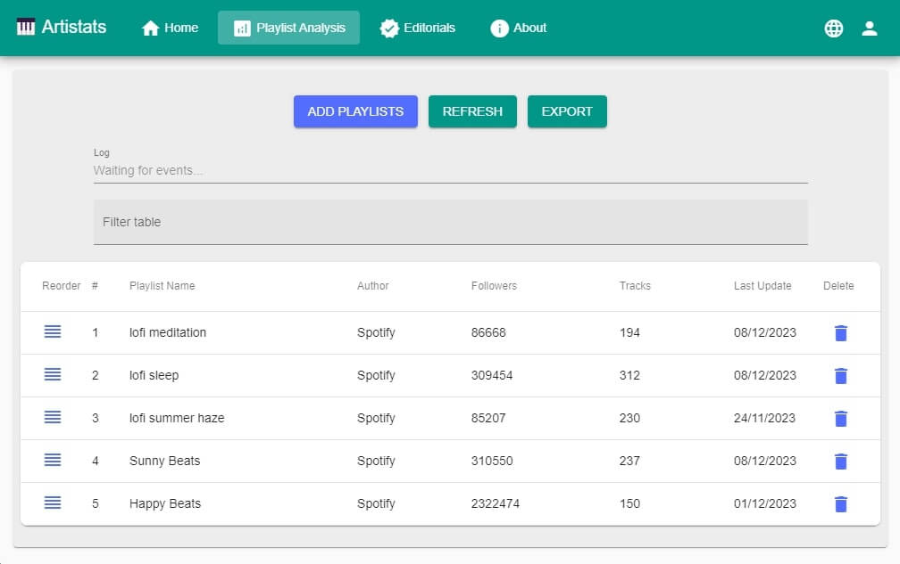
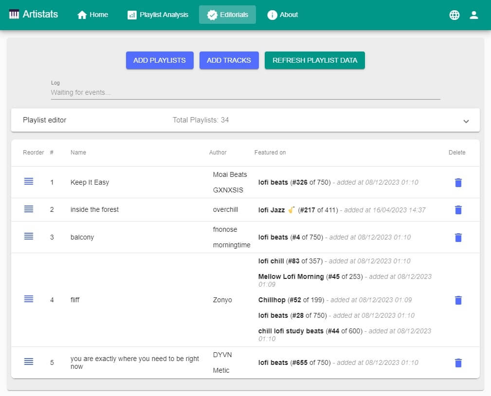
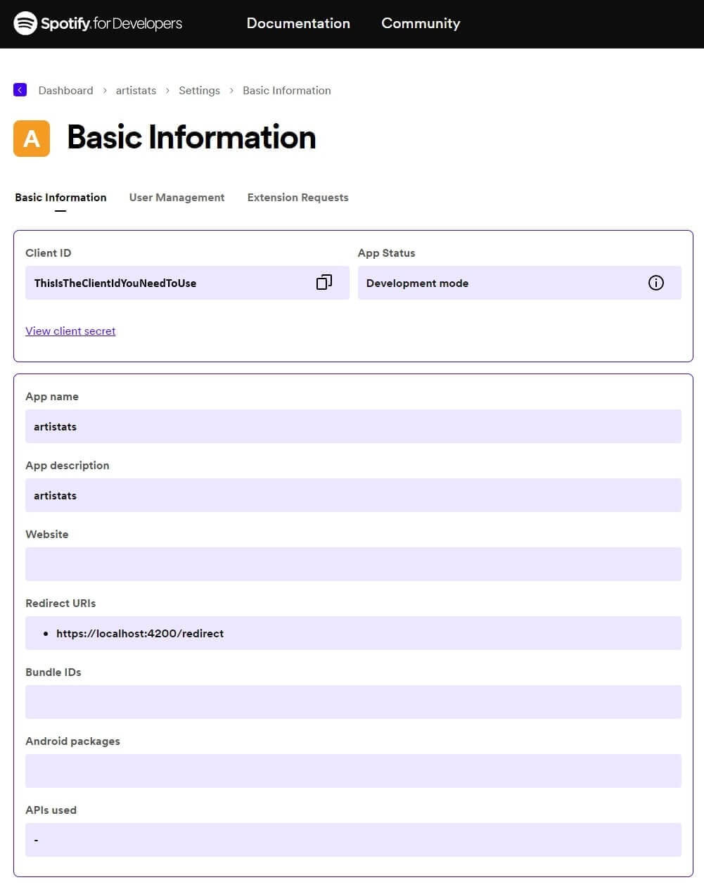
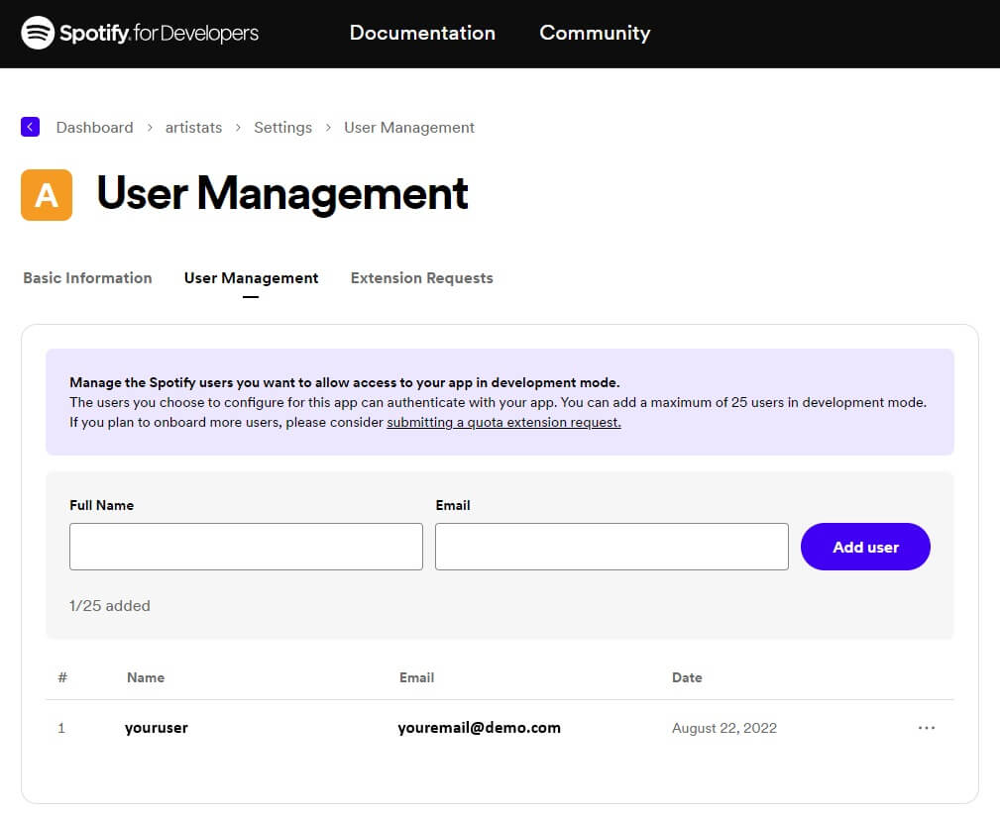

# 🎹 Artistats - Spotify Artist Tools

This little project allows you to track playlist growth and detect editorial placements.

It can be used to:

- Check playlist followers and see the last update date, with the option to export data to excel
- Check if songs have been featured on playlists, when they have been added, and at which position

New pull requests and features are welcome, but there is not plan to extend the tool for now.

> :warning: **Disclaimer: _Use the Spotify For Developer tools under your own responsibility. As stated in the [license](LICENSE), I am by no means responsible for the use of this software._** _Please note that this was made for my own needs and may not fit your use case._

## Example

<p align="center">
  
  <br>
  <i>Simple playlist analysis</i>
</p>

<p align="center">
  
  <br>
  <i>Find which songs have been featured on playlists</i>
</p>

## How to use

### Request Spotify dev token

Go to [Spotify for Developers](https://developer.spotify.com/dashboard) and login with the account you want to use to host the app that will receive queries from Artistats.

Create a new App with this configuration to get a Client ID (you don't need to select any API):

- Name and description: Artistats
- App Status: Development mode
- Redirect URI: https://localhost:4200/redirect

<p align="center">
  
</p>

Now add the Spotify accounts that will be authorized to use the app (you can add multiple accounts). If you want to use the Spotify account you used to create the app in Spotify for Developers, add it here too:

<p align="center">
  
</p>

Finally, create a `.env` file in the root folder of Artistats which contains the Client ID of your app (see the [.env.example](.env.example)):

```
SPOTIFY_CLIENT_ID='yourclientid'
```

### Generate localhost certificate

To interact with Spotify we need to use https, so we need to generate a certificate for localhost.

This is the working setup tested on a Windows machine (find alternatives [here](https://medium.com/@mariokandut/how-to-configure-ssl-locally-in-angular-413077568caa)):

- Install choco: https://chocolatey.org/install
- Install mkcert, install the local CA and create the certificate:

```
choco install mkcert
mkcert -install
mkcert localhost
```

Now copy the generated files to the root folder [certificates](certificates), it should contain two files with those exact names:

- certificates/localhost-key.pem
- certificates/localhost.pem

You can install the certificate to your computer or browser to prevent having warnings about connection privacy.

### Install and run Artistats

Be sure to have [Node.js](https://nodejs.org/en/download/) installed, then:

- [Download](https://github.com/joanroig/artistats/archive/refs/heads/main.zip) or clone the repo.
- Run `npm install -g yarn` to install Yarn
- Run `yarn install` in the root folder to install dependencies.
- Run `npm run start` to start the tool, it will open automatically at https://localhost:4200/home

You need to be logged in on https://open.spotify.com/ with the account you authorized in Spotify for Developers in order to login to Artistats.

### Troubleshoot

#### Warning when opening Artistats: "Your connection is not private"

Check if you have installed the certificate, or try other solutions provided [here](https://stackoverflow.com/questions/50534200)

#### Connection error when logging in: "This site can't provide a secure connection"

Check if your certificates have been generated properly and are in the right folder. If all looks fine, try clearing the browser cache and localhost data to refresh the certificate.
